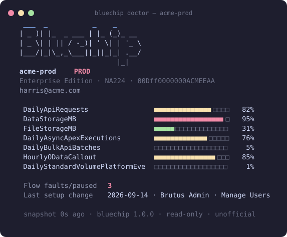
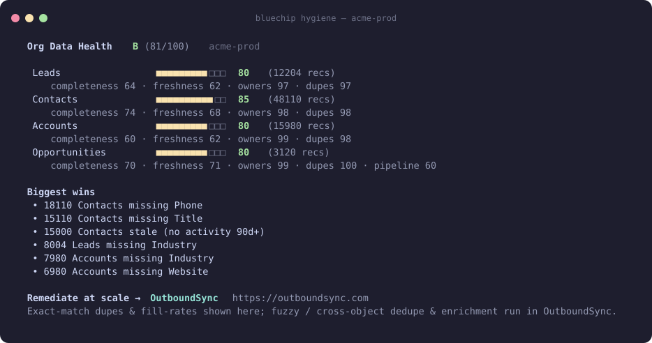

# Bluechip — demo walkthrough

A 60-second walkthrough of Wave 1 on the `bluechip-v1` **active build tip**.
`main` may still hold parked vision until a later promote. This is not a launch
kit for a letter-grade product.

## The shots



`bluechip doctor` is an org-vitals card: org, a PROD/SANDBOX/**UNKNOWN** badge,
live limit gauges (or unknown if Limits missed), the last **measured** data
probe (or “unknown — not graded”), and the last Setup change.



`bluechip hygiene` is a **read-only probe**, not a viral grade. It shows
per-object measured / unknown cards. Completeness is only over fields the
running user can actually query. A dimension miss is `?`, not 100. An
all-unknown scan has no letter and does not overwrite last-good cache.

Local probe ≠ OutboundSync product. An optional remediate deep-link appears
only when `BLUECHIP_REMEDIATE_URL` is set.

## 60-second script

```bash
# 0. You already did this once — bluechip rides it, no Connected App:
sf org login web

# 1. The card
bluechip doctor

# 2. It lives in your bar. Amber before red, PROD vs SANDBOX vs UNKNOWN.
#    (Waybar chip — see README "Install the chip")

# 3. Never debug the wrong org again — pin from the bar, or:
bluechip orgs
bluechip pin acme-uat

# 4. What's on fire and what changed:
bluechip limits
bluechip flows
bluechip changes

# 4b. Probe data (measured / unknown — not a marketing grade)
bluechip hygiene
bluechip hygiene --json   # availability / dimensions / error shape

# 5. Hand-off for an agent (display-only — not write authority):
bluechip context | wl-copy

# 6. Named creds (never prints secrets) + confirm-gated debug:
bluechip named-creds
bluechip trace start          # type SANDBOX / alias; type PROD on prod
bluechip logs --follow

# 7. Local MCP (optional):
bluechip mcp-config
```

## Why an admin cares (say this)

- **Org split-brain, reduced.** A prod chip you cannot mistake for a sandbox;
  UNKNOWN when we could not read `Organization.IsSandbox`.
- **Limits before they page you.** API, storage, async Apex, platform events —
  amber → red in the bar. A limits miss is unknown, not a healthy 0%.
- **Agent context pack.** `bluechip context` assembles org id, limits, Flow
  faults, and ApexLog ids into one paste. It is not authorization to deploy.
- **Read-only.** Uses *your* `sf` login. No Connected App, no stored secrets,
  nothing written to your org. Writes/confirm-gate come later, sandbox-first
  ([matrix](../VISION.md#confirm-before-write-matrix)).

## Copy (honest)

**X / short:**
> Salesforce org pulse in the Linux status bar. Bluechip (Omarchy):
> PROD/SANDBOX/UNKNOWN chrome, live API-limit gauges, Flow faults, and a
> one-command agent context pack. Experimental side branch; `main` is parked.
> Open source, MIT, uses your own `sf` login — no Connected App.

Do **not** use “What does yours get?” / letter-grade-as-org-truth copy.

**Omarchy community:**
> Waybar module for Salesforce admins: Bluechip. Org pulse + PROD/SANDBOX/
> UNKNOWN chrome + limit gauges + Flow faults, read-only over your own `sf`
> login. `bluechip doctor` is a neofetch-style org card. Side branch, not
> unparked main.

## Notes / honesty

- Flow faults are **best-effort**: hard faults roll back and may not persist as
  `FlowInterview` rows.
- Wave 1 calls `sf org display`, `sf org list limits`, `sf data query`,
  `sf sobject describe`, **Tooling** for NamedCredential / ExternalCredential /
  TraceFlag / DebugLevel, `sf apex get log`, and Metadata **list** (names only)
  as a fallback. **Not** Metadata retrieve/deploy.
- Hygiene acceptance tests: `./scripts/test-hygiene.sh` (H1–H10). Wave 1:
  `./tests/test-named-creds.sh`, `./tests/test-trace.sh`, `./tests/test-mcp.sh`.
